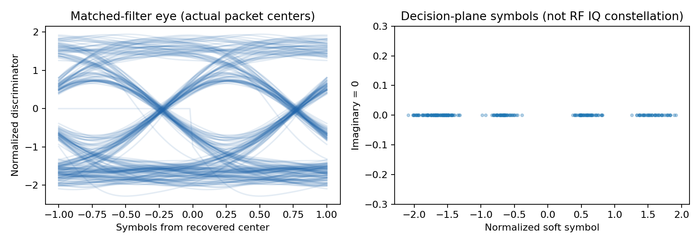

# Stage O 修复版：实际验证结果

日期：2026-10-05。Python/NumPy/SciPy 全段真实回放；GNU/Pluto 状态单列。

| 用例 | IQ时长(s) | SPS | 分片 | CRC帧次 | CRC候选成功率 | 核心耗时(s) | 回放倍速 | 峰值RSS(MiB) |
|---|---:|---:|---:|---:|---:|---:|---:|---:|
| long_fixed | 70.123520 | 47 | 6695 | 3662 | 99.38% | 19.657 | 3.57x | 246.6 |
| long_auto | 70.123520 | 47 | 6698 | 3664 | 99.38% | 21.070 | 3.33x | 248.2 |
| short_auto | 3.997696 | 47 | 392 | 217 | 100.00% | 1.300 | 3.08x | 241.9 |
| short_sps52 | 3.997696 | 52 | 0 | 0 | N/A | 0.991 | 4.03x | 234.7 |
| short_partitioned | 3.997696 | 47 | 392 | 217 | 100.00% | 1.008 | 3.96x | 243.0 |

固定长录波的 3662 帧，及短录波的 217 帧，与此前实测参考的完整帧字节顺序完全相同。自动长录波为 3664 帧：没有将固定参考计数充当自动模式结果。两种模式的负载内容仍为同一组重复 0A01～0A05 状态。

CRC率分母为：CRC8有效、长度/CMD支持、完整到齐的 CRC16 尝试候选。不是物理包投递率、BER 或所有发射包的百分比。

| 用例 | 单批CPU处理p95(ms) | 模型缓冲等待p95(ms) | 首帧CPU墙钟(s) | 最终CFO同步估计(Hz) |
|---|---:|---:|---:|---:|
| long_fixed | 158.815 | 585.783 | 0.125 | +32760.824 |
| long_auto | 180.221 | 585.763 | 0.313 | +32811.114 |
| short_auto | 282.775 | 581.028 | 0.344 | +541.383 |
| short_sps52 | 127.946 | N/A | N/A | +541.127 |
| short_partitioned | 137.105 | 581.028 | 0.116 | +541.127 |

首帧CPU墙钟是离线读盘模式，不能当作直播空口首帧时延。缓冲等待是按源样本和右上下文推导的软件模型，设备/IIO缓冲与 CPU 时间另算；缺乏硬件/发射时间戳，因此没有报告实测 RF→主机时延。

最大单进程 RSS 约 248.2 MiB；按实际固定窗读取和处理，没有大文件全量重采样。性能数值属于本沙箱 CPU/文件系统，不保证在另一台主机上完全相同。

另测 0.1 秒低延时块：4 秒文件仍解出 392 分片、217 帧；CPU回放 2.605 秒，模型缓冲 p95 206.826 ms，单批 CPU p95 71.377 ms。该配置只在上述短文件做了本次实测。

## 已执行检查

- 原 PIONEER CRC 函数与本版在全部 3879 个原参考帧上交叉一致。
- 半个帧头留在分片末尾时正确等待，不越界；人为损坏 CRC 的帧被拒绝。
- 任意输入块大小、最后未满块和 finish 幂等处理通过。
- GNU 输出传输队列逐样本/标签索引与独立核心相同；没有借此声称 GNU 调度器已运行。
- 自动 SPS47/52、正/负 CFO、IQ 共轭阳性控制通过，合成计数不加入真实录波统计。
- 名义宽调制阳性控制可回退宽滤波；纯噪声不出 CRC 帧。
- Python编译、shell语法、GRC YAML结构及参数类型检查通过。

## 尚未实跑的部分

- GNU Radio 调度器、Companion 编译器与 Qt GUI：本沙箱没有 GNU Radio；系统安装路径因权限限制不可用。完整代码已提供，使用 validate_gnu_on_host.sh 真正验收帧字节和实际输出流哈希。
- Pluto硬件：本沙箱未连接设备，实时源接口已实现；不可用本机离线倍速替代硬件吞吐/丢样验证。
- JAM/L1～L3/双路与动态比赛状态：未从本批 INFO 成功推导这些条件已经验证。

实际眼图（来自自动长录波接收软样本）：

上图软符号受GFSK成形/ISI影响，可能存在多组电平；不是把原始RF IQ伪装为BPSK。
